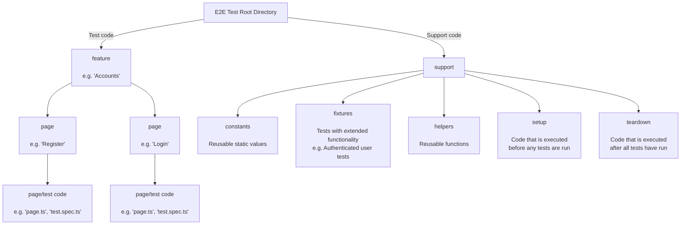

# E2E Tests - Playwright

This project uses [`Playwright`](https://playwright.dev/) to manage its E2E (end-to-end) tests.

## Running the Tests

There are a few ways to run this project's E2E tests:

- Navigate to the directory that contains the Javascript-based testing projects (located at `/test/js/` as of the current writing) and run `npm run e2e`.
- You can also use the convenience scripts located in the `/scripts/` folder:
  - To run the tests once, run `/scripts/test-e2e`
  - To run the tests in watch mode, run `/scripts/test-e2e-watch`

### Coordinating With the Web Server

When running the E2E tests, a web server is automatically started using the parameters in `../playwright.config.ts`, in the `webServer` key of the configuration object.

#### Temporary SQL Sandbox

This project's Phoenix web server has the [Ecto SQL Sandbox](https://hexdocs.pm/phoenix_ecto/Phoenix.Ecto.SQL.Sandbox.html) feature enabled. This allows you to run a set of tests that are isolated from any others. This sandbox can be created and destroyed as needed to maintain idempotency during tests.

- Create a temporary SQL sandbox:
  - Issue an empty POST request to `$TEST_SERVER_URL/sandbox`.
  - The server will return a response body that represents a custom user agent.

- Using a temporary SQL sandbox:
  - Modify your request headers to use the custom user agent when making requests to your temporary SQL sandbox.
    - e.g. `user-agent: BeamMetadata (g2gCZAACd...kAAR0cnVl)`

- To destroy a temporary SQL sandbox:
  - Issue a DELETE request to `$TEST_SERVER_URL/sandbox` that contains the modified user agent string associated with your temporary SQL sandbox.

## Project Structure

This test suite can be broadly divided into two sections: test code, and support code.

### Test Code

The E2E tests for this project are structured by feature. The file hierarchy goes `feature` -> `page` -> `code`.

Each page directory contains two types of files: `page` code and `test` code:

- Page code (e.g. `page.ts`) uses the [Page Object Model](https://playwright.dev/docs/pom) to abstract out pages into manageable components, including:
  - `URLs` - URLs associated with a given page and its workflow:
    - e.g. The URL for a registration page: `this.url = '/users/register'`
    - e.g. The URL to redirect to after successful registration: `this.urlSuccess = '/users/login'`
  - `Elements` - HTML elements that can be found on the page, such as buttons or form inputs.
    - Elements are identified by their CSS selectors. Playwright uses the `Locator` object to create references to HTML elements.
    - Examples:
      - e.g. `pageTitle = page.locator("h1#page-title")`
      - e.g. `itemContent = page.locator(".item", { hasText: 'some item content'})`
      - e.g. `formButtonSubmit = page.locator("#login-form").locator("button[type='submit']")`
  - `Actions` - An actions consist of one or more events performed on a locator (e.g. `formButtonSubmit.click()`) to accomplish a desired result.
    - e.g. `userRegister()` - Fill out and submit a user registration form.

- Test code (e.g. `test.spec.ts`) contains the tests.

### Support Code

Non-test code can be found in the `./support` directory. This includes:

- `constants` - Static values used throughout the tests.
  - e.g. `validPassword` - A password that meets the server's password validity requirements.
- `fixtures` - Extended test functions that allow you to group tests by meaning.
  - e.g. `authenticatedTest` - A test fixture that automatically authenticates a user before running the tests.
- `helpers` - Miscellaneous functions used throughout the tests.
  - e.g. `emailGenerateRandom()` - Generate a random email when registering a new user.
- `setup` - Code that is called before running tests.
  - e.g. `setup/global.ts` - Code that is executed after the test service has initialized, before any tests are run.
  - e.g. `setup/enable-dark-mode.ts` - Enable dark mode before running the tests.
    - NOTE: Custom setup scripts must be listed as a [dependency](https://playwright.dev/docs/test-projects#dependencies) for a given project.
- `teardown` - Code that is executed after all tests have finished.

## Writing Tests

It is a good idea to follow Playwright's [Best Practices](https://playwright.dev/docs/best-practices) guide when writing new tests. The following recommendations are written to my future self (or whoever!) in response to issues encountered when I was learning the ins and outs of Playwright:

- It is best to base new locators on "user-visible behavior" in order to prevent coupling test behavior to properties which could change during the course of development.
  - Instead of binding new locators to CSS/XPath classes, prefer binding them by role, test IDs, etc.
  - For more info, see the [Locators](https://playwright.dev/docs/locators) section of the Playwright docs.
- Use await-friendly assertions when writing your tests.
  - Examples from the Best Practices guide:
    - Do this: `await expect(page.getByText('welcome')).toBeVisible();`
    - Not this `expect(await page.getByText('welcome').isVisible()).toBe(true);`
  - The first test is better because it will wait for the value to become available, while the second one will get the value instantly (which may not be what you want).
